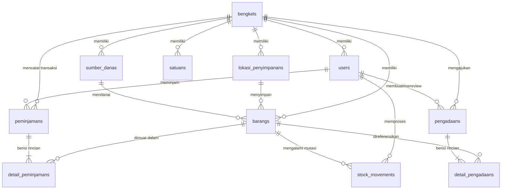

# PRD: SIBENKA (Sistem Inventaris Bengkel Skagata)

- **Versi Dokumen:** 2.1 (Production Release Specification - Extended)
- **Tanggal Rilis:** 07 Oktober 2026
- **Status:** Disetujui & Terimplementasi Penuh (Post-Remediation & Feature Expansion)
- **Target Institusi:** SMK Negeri 3 Yogyakarta

---

## 1. Tujuan & Latar Belakang

### 1.1 Latar Belakang

SMK Negeri 3 Yogyakarta (Skagata) memiliki beragam unit bengkel kejuruan (Audio Visual, Bangunan, Gudang Utama, Listrik, Mesin, Otomotif, Teknologi Informasi, dll.) dengan intensitas sirkulasi peminjaman alat praktik dan konsumsi bahan yang tinggi setiap harinya. Pengelolaan manual rentan menyebabkan kehilangan alat, kerusakan fisik yang tidak terpantau penanggung jawabnya, stok bahan praktik yang mendadak habis (_stock-out_), bentrok jadwal peminjaman alat terbatas antar kelas/guru, serta hambatan administrasi penyusunan Rencana Anggaran Biaya (RAB) pengadaan sekolah.

### 1.2 Tujuan Utama Sistem

Sistem Informasi Inventaris Bengkel Skagata (**SIBENKA**) dibangun untuk:

1. **Digitalisasi Sirkulasi & Penjadwalan Alat:** Memfasilitasi peminjaman langsung maupun pemesanan terjadwal di muka (_advance booking_ hingga 14 hari) dengan alur verifikasi cek fisik kondisi barang (baik, rusak, hilang) saat pengembalian.
2. **Persetujuan Bertahap Akuntabel (Two-Stage Approval):** Mengamankan alokasi kuota alat terencana tanpa memotong stok fisik sebelum barang diserahkan langsung di meja teknisi.
3. **Pengawasan Bahan Habis Pakai (BHP):** Memantau konsumsi bahan secara otomatis tanpa prosedur pengembalian, serta memberikan peringatan dini (_low-stock alert_) saat stok mendekati batas minimum.
4. **Penyusunan & Realisasi RAB:** Memfasilitasi Toolman menyusun draf RAB pengadaan berbasis kebutuhan riil bengkel, memproses persetujuan Waka Sarpras, dan mengotomatisasi pencatatan stok masuk saat barang fisik diterima.
5. **Integritas Audit Mutasi:** Menyediakan catatan riwayat pergerakan stok (_stock card/audit trail_) yang tidak dapat dimanipulasi, mendukung ekspor laporan resmi dalam format Spreadsheet dan dokumen cetak F4/Folio.

---

## 2. Definisi Peran & Hak Akses (User Roles)

Sistem menetapkan 3 level peran pengguna dengan batasan akses yang terisolasi secara ketat:

### 2.1 Super Admin (Waka Sarpras)

- Meninjau dashboard analitik eksekutif multi-bengkel (total aset sekolah, barang dipinjam, kerusakan alat, dan status stok BHP).
- Memverifikasi pengajuan RAB dari seluruh bengkel kejuruan dengan keputusan: **Approve (Setujui)**, **Revisi** (dengan catatan perbaikan), atau **Reject (Tolak)**.
- Mengakses dan mengunduh laporan rekapitulasi mutasi aset dan konsumsi bahan seluruh jurusan dalam format Excel dan PDF siap cetak.
- Mengelola master data unit bengkel (`bengkels`).
- Mengelola akun staf Toolman, penempatan bengkel tugas, dan mereset password akun Toolman jika diperlukan.
- Mengelola profil pribadi dan kata sandi mandiri.
- **Karakteristik Akun:** `bengkel_id` bernilai `NULL` karena Waka Sarpras mengawasi seluruh unit sekolah.

### 2.2 Admin Bengkel (Toolman)

- Terikat pada satu unit bengkel tertentu (`bengkel_id` wajib terisi).
- Mengelola master barang (Alat Inventaris dan Bahan Habis Pakai) pada bengkelnya (tambah, edit, hapus, cetak kartu barang, ekspor, dan impor spreadsheet).
- Mengelola master lokasi penyimpanan (`lokasi_penyimpanans`) di lingkup bengkelnya.
- Mengelola master satuan barang (`satuans`) yang digunakan bengkel.
- Mengelola master sumber dana anggaran (`sumber_danas`) pengadaan barang.
- Memproses antrean permohonan pinjam: **Setujui Jadwal** (reservasi kuota) atau **Serahkan Langsung** (approval fisik) serta opsi **Tolak Pengajuan** dengan alasan wajib.
- Memproses cek fisik pengembalian alat inventaris melalui **3 tab kerja** (`Menunggu Cek Fisik`, `Sedang Dipinjam`, `Riwayat Pengembalian`) dan mencatat unit kembali baik, rusak, atau hilang.
- Menyusun draf usulan RAB pengadaan bengkel dan mengajukannya ke Waka Sarpras.
- Melakukan **penerimaan fisik barang RAB** (`receive`) yang telah disetujui Waka, yang secara otomatis menambah stok atau mendaftarkan barang baru dengan audit mutasi.
- Memverifikasi registrasi akun peminjam baru (Approve atau Reject), serta menangguhkan (_suspend_) atau mengaktifkan kembali akun peminjam bermasalah.
- Memantau kartu stok dan riwayat mutasi bengkel (`mutasi`).
- Mengubah profil dan kata sandi mandiri.

### 2.3 Peminjam (Siswa & Guru)

- Mendaftar akun mandiri dan menunggu persetujuan (_approval_) dari Toolman.
- Menjelajahi katalog alat dan bahan praktik (_mobile-first_).
- Membuat permohonan pinjam: bisa untuk hari-H atau terjadwal di muka (maksimal 14 hari ke depan).
- Mengajukan pengembalian fisik alat inventaris melalui antarmuka _Tiket Saya_.
- Memantau status tiket sirkulasi secara _real-time_ (_Pending_, _Disetujui/Jadwal Terkonfirmasi_, _Active_, _Terlambat_, _Menunggu Pengecekan_, _Selesai_, _Ditolak_).
- Mencetak bukti permohonan pinjam dan tanda terima pengembalian (terkunci otomatis jika tiket ditolak).
- Mengubah profil dan kata sandi mandiri.

**Klasifikasi Peminjam:**
- **Siswa (`jenis_peminjam = 'siswa'`):** Wajib terikat pada satu bengkel jurusan (`bengkel_id` wajib). Siswa hanya diizinkan meminjam barang yang berada di bengkel jurusannya.
- **Guru (`jenis_peminjam = 'guru'`):** Tidak terikat pada satu bengkel (`bengkel_id = NULL`). Guru diizinkan meminjam alat atau bahan lintas bengkel sesuai kebutuhan mata pelajaran yang diampu.

---

## 3. Aturan Bisnis Sistem (Business Rules)

### 3.1 Isolasi Data Multi-Bengkel

- Data bengkel (`bengkels`) menjadi partisi utama isolasi data barang, lokasi, dan transaksi sirkulasi.
- Toolman hanya dapat melihat dan memodifikasi data barang, lokasi, peminjaman, pengadaan, dan mutasi yang berada pada `bengkel_id` miliknya. Akses ke bengkel lain ditolak dengan kode respon HTTP 403 Forbidden.
- Kode barang dan kode lokasi penyimpanan bersifat unik per bengkel: kombinasi `(bengkel_id, kode_barang)` dan `(bengkel_id, kode)` tidak boleh duplikat, namun kode yang sama diperbolehkan berada pada bengkel yang berbeda.

### 3.2 Pencatatan Barang & Kalkulasi Kuota Bebas (Quantity-Based Inventory)

- Barang dicatat menggunakan pendekatan **Quantity-Based**, bukan nomor seri per unit. Satu baris barang merepresentasikan total stok fisik unit tersebut di bengkel.
- Setiap barang memiliki dua kategori utama (`jenis_barang`):
    1. **Inventaris:** Alat praktik yang wajib dikembalikan setelah kegiatan belajar selesai.
    2. **Bahan Habis Pakai (BHP):** Bahan praktik yang habis terkonsumsi dan tidak memiliki alur pengembalian.
- **Formula Konsistensi Stok Fisik Inventaris:**
  $$\text{stok\_total} = \text{stok\_tersedia} + \text{stok\_dipinjam} + \text{stok\_rusak}$$
- **Formula Kuota Bebas untuk Booking/Peminjaman Baru:**
  $$\text{stok\_reserved} = \sum_{\text{tiket status 'disetujui'}} \text{jumlah}$$
  $$\text{stok\_bebas} = \max(0, \text{stok\_tersedia} - \text{stok\_reserved})$$
  Jika peminjam meminta kuota melebihi $\text{stok\_bebas}$, sistem menolak pengajuan untuk melindungi jadwal peminjam terdahulu yang telah disetujui.
- Setiap barang terikat pada lokasi penyimpanan (`lokasi_penyimpanan_id`), sumber dana (`sumber_dana_id`), satuan baku (`satuan`), batas minimum stok (`minimum_stok`), dan harga perolehan (`harga`).
- Data barang **tidak menggunakan file foto/gambar upload** demi menjaga performa penyimpanan dan kepraktisan operasional bengkel sekolah. Antarmuka katalog menggunakan visualisasi berbasis ikon kategori yang ringan.

### 3.3 Sirkulasi Peminjaman, Advance Booking, & Persetujuan 2-Tahap

- **Pemesanan Terjadwal (Advance Booking):** Peminjam dapat memilih tanggal peminjaman di masa depan hingga batas maksimal **14 hari ke depan**. Peminjaman dengan tanggal di masa lalu atau lebih dari 14 hari otomatis ditolak oleh validasi sistem.
- **Alur Persetujuan 2-Tahap (Two-Stage Approval):**
    1. **Tahap 1 - Setujui Jadwal (`setujuiJadwal`):**
       Toolman menyetujui jadwal peminjaman. Status tiket berubah menjadi `disetujui`. Kuota `stok_reserved` barang terkunci, sementara stok fisik `stok_tersedia` belum berkurang karena barang masih berada di rak bengkel.
    2. **Tahap 2 - Serahkan Barang Fisik (`approve`):**
       Pada hari-H saat peminjam datang ke meja bengkel dan menerima fisik alat, Toolman menekan tombol *Serahkan Barang*. Status berubah menjadi `active`, `stok_tersedia` berkurang, dan kuota reservasi dilepaskan.
    3. **Pembatalan / Penolakan Tiket Terjadwal (`reject`):**
       Jika peminjam membatalkan praktikum, Toolman dapat membatalkan tiket dengan alasan tertulis; kuota `stok_reserved` otomatis dilepas kembali menjadi kuota bebas.
- **Tiket Langsung Hari-H:** Jika peminjaman untuk hari itu juga, Toolman dapat langsung mengeksekusi *Serahkan Langsung* (`approve`) yang memotong stok fisik seketika.
- **Konsumsi Bahan (BHP):** Bahan habis pakai langsung dipotong permanen dari `stok_tersedia` dan `stok_total` saat diserahkan. Jika tiket hanya berisi BHP, status tiket langsung berubah menjadi `selesai`.

### 3.4 Cek Fisik Pengembalian 3-Tab & Integritas ACID

Halaman pemeriksaan fisik pengembalian Toolman (`/toolman/pengembalian`) dibagi menjadi 3 tab kerja:
1. **Menunggu Cek Fisik (`tab=menunggu_pengecekan` - Default):**
   Antrean utama meja kerja Toolman. Hanya memuat tiket yang peminjamnya **sudah menekan tombol ajukan pengembalian** di aplikasi. Menyediakan tombol aksi utama: *Cek Fisik & Konfirmasi Kembali*.
2. **Sedang Dipinjam (`tab=sedang_dipinjam`):**
   Monitoring alat yang masih berada di luar. Tombol cek fisik tidak aktif bebas guna mencegah salah pencet dini; dilengkapi tombol sekunder *Terima & Cek Fisik Langsung* dengan dialog konfirmasi (*modal*) untuk situasi di mana peminjam mengembalikan alat langsung tanpa membuka aplikasi.
3. **Riwayat Pengembalian (`tab=riwayat`):**
   Arsip seluruh pemeriksaan fisik yang telah tuntas.
- **Formula Kondisi Fisik Pengembalian:**
  $$\text{jumlah\_kembali\_baik} + \text{jumlah\_kembali\_rusak} + \text{jumlah\_hilang} = \text{jumlah\_dipinjam}$$
  - Unit kembali baik: dipindahkan dari `stok_dipinjam` ke `stok_tersedia` (mutasi `pengembalian_baik`).
  - Unit kembali rusak: dipindahkan dari `stok_dipinjam` ke `stok_rusak` (mutasi `pengembalian_rusak`).
  - Unit hilang: mengurangi `stok_dipinjam` dan `stok_total` permanen (mutasi `barang_hilang`).
- **Kunci Konkurensi Database (InnoDB Row Locking):** Pengecekan fisik dan persetujuan pinjam wajib mengunci baris database (`lockForUpdate()`) dengan urutan kunci deterministik (tiket peminjaman terlebih dahulu, disusul baris barang terurut menaik `ORDER BY id ASC`) untuk mencegah _deadlock_.

### 3.5 Kebijakan Pencetakan Dokumen Sirkulasi

- **Tiket Ditolak (`status: ditolak`):** Seluruh akses cetak bukti pinjam dan bukti pengembalian **diblokir** (*access denied*), karena barang tidak pernah dipinjam.
- **Tiket Aktif / Terjadwal:** Hanya bukti peminjaman yang dapat dicetak.
- **Tiket Selesai:** Bukti peminjaman dan bukti pengembalian fisik dapat dicetak resmi dalam format standar F4/Folio.

### 3.6 Pengadaan, RAB, & Penerimaan Fisik Otomatis

- Toolman menyusun usulan RAB pengadaan barang bengkelnya.
- **Klasifikasi Eksplisit Barang Baru:** Setiap rincian barang baru pada RAB wajib memiliki jenis definitif (`inventaris` atau `bhp`) dan batas minimum stok (`minimum_stok`) eksplisit tanpa tebak-tebakan kata kunci.
- **Siklus Telaah Waka Sarpras:** Waka Sarpras meninjau RAB dan menetapkan status `approved`, `revisi`, atau `rejected`.
- **Integritas Anti-Tampering:** Klasifikasi jenis barang dan batas minimum yang disetujui Waka Sarpras terkunci permanen.
- **Eksekusi Penerimaan Fisik (`receive`):**
  Aksi konfirmasi kedatangan barang oleh Toolman:
  - Barang terdaftar: menambah `stok_total` dan `stok_tersedia`.
  - Barang baru: otomatis mendaftarkan entitas `Barang` baru dengan kodefikasi bengkel, harga dari RAB, dan lokasi default.
  - Tercatat otomatis ke `stock_movements` jenis `stok_masuk` lengkap dengan aktor dan nomor RAB.
  - Status pengadaan berubah menjadi `selesai`.

### 3.7 Keamanan Batasan Impor & Ekspor Spreadsheet

- **Format Diterima:** Hanya file `.xlsx` dan `.csv`/`.txt` UTF-8. Format biner lama `.xls` ditolak eksplisit.
- **Batasan Beban:** Maksimal file 5 MB, batas arsip zip 100 entri, batas XML 20 MB, dan batas data 5.000 baris.
- **Proteksi XXE:** Parser XML menonaktifkan resolusi entitas eksternal (`LIBXML_NONET | LIBXML_NOENT`).
- **Pencegahan Formula Injection:** Seluruh teks yang diawali karakter formula (`=`, `+`, `-`, `@`, `\t`, `\r`) diekspor dengan awalan tanda petik tunggal (`'`).
- **Transaksi All-or-Nothing:** Jika satu baris impor gagal divalidasi, seluruh proses di-*rollback*.

### 3.8 Kebijakan Akun & Autentikasi Sekolah

- Tanpa pengiriman email lupa password publik via SMTP; reset kata sandi dilakukan secara tatap muka oleh Toolman atau Waka Sarpras.
- Rute registrasi publik dibatasi *rate-limiting* ketat (maksimal 6 permintaan per menit).
- Peminjam baru berstatus `menunggu_acc` hingga disetujui oleh Toolman penanggung jawab bengkel.

---

## 4. Manajemen Status (State Management)

### 4.1 Status Tiket Peminjaman (`peminjamans.status`)

```
                          ┌───────────────┐
                          │    Pending    │
                          └───────┬───────┘
            Reject                │               Approve Langsung (Hari-H)
     ┌────────────────────────────┼────────────────────────────────────────┐
     │                            │ Setujui Jadwal                         │
     ▼                            ▼                                        ▼
┌─────────┐             ┌────────────────────┐                  ┌──────────────────┐
│ Ditolak │             │ Disetujui (Jadwal) │                  │ Active (Pinjam)  │──(BHP)──►┌─────────┐
└─────────┘             └─────────┬──────────┘                  └─────────┬────────┘          │ Selesai │
     ▲                            │ Serahkan Fisik (Hari-H)               │                   └─────────┘
     │ Batalkan Tiket             └───────────────────────────────────────┤ Lewat Jam Bengkel      ▲
     └────────────────────────────────────────────────────────────────────┼                        │
                                                                          ▼                        │
                                                                ┌──────────────────┐               │
                                                                │    Terlambat     │               │
                                                                └─────────┬────────┘               │
                                                                          │ Ajukan Kembali         │
                                                                          ▼                        │
                                                                ┌──────────────────┐               │
                                                                │ Menunggu Cek     │               │
                                                                │ Fisik Toolman    │───────────────┘
                                                                └──────────────────┘  Verifikasi Fisik
```

### 4.2 Status Pengajuan RAB Pengadaan (`pengadaans.status`)

- `draft`: Usulan sedang disusun oleh Toolman.
- `pending`: Diajukan ke Waka Sarpras, menunggu telaah.
- `revisi`: Dikembalikan oleh Waka Sarpras disertai catatan perbaikan.
- `approved`: Disetujui resmi oleh Waka Sarpras; siap dibelanjakan.
- `rejected`: Ditolak oleh Waka Sarpras; usulan dihentikan.
- `selesai`: Barang fisik telah tiba dan diverifikasi penerimaannya oleh Toolman.

### 4.3 Status Akun Pengguna (`users.status`)

- `menunggu_acc`: Akun baru mendaftar mandiri, belum disetujui Toolman.
- `aktif`: Akun terverifikasi dan memiliki izin operasional penuh.
- `suspend`: Akun ditangguhkan akibat pelanggaran tata tertib bengkel.
- `nonaktif`: Akun dinonaktifkan permanen (alumni/pindah sekolah).

---

## 5. Skema Data & Relasi (Database Schema v2.1)

SIBENKA menggunakan 11 tabel relasional utama pada MySQL InnoDB:



### 5.1 Rincian Entitas Data Utama

| Nama Tabel | Deskripsi & Aturan Integritas Kunci |
| :--- | :--- |
| `bengkels` | Master data bengkel kejuruan (`id`, `kode`, `nama`, `deskripsi`). Kode bengkel unik (contoh: `BGK-TKJ`, `BGK-AV`). |
| `lokasi_penyimpanans` | Master lokasi lemari/rak penyimpanan di dalam bengkel. Unique composite: `(bengkel_id, kode)`. Menolak hapus jika masih berisi barang. |
| `satuans` | Master satuan baku per bengkel (`id`, `bengkel_id`, `nama`, `singkatan`, `deskripsi`). |
| `sumber_danas` | Master mata anggaran belanja (`id`, `bengkel_id`, `nama`, `kode_anggaran`, `tahun_anggaran`, `deskripsi`). |
| `users` | Akun seluruh pengguna (`id`, `bengkel_id`, `name`, `email`, `password`, `role`, `jenis_peminjam`, `nomor_identitas`, `nomor_wa`, `status`). |
| `barangs` | Master persediaan barang bengkel (`id`, `bengkel_id`, `lokasi_penyimpanan_id`, `sumber_dana_id`, `kode_barang`, `nama`, `jenis_barang`, `satuan`, `stok_total`, `stok_tersedia`, `stok_dipinjam`, `stok_rusak`, `minimum_stok`, `harga`, `deskripsi`). Unique composite: `(bengkel_id, kode_barang)`. Memiliki dynamic accessor `stok_reserved` & `stok_bebas`. |
| `peminjamans` | Header transaksi peminjaman (`id`, `user_id`, `bengkel_id`, `tanggal_pinjam`, `batas_kembali`, `keperluan`, `status`, `diproses_oleh`, `diproses_pada`, `alasan_penolakan`). |
| `detail_peminjamans` | Rincian barang pinjaman (`id`, `peminjaman_id`, `barang_id`, `jumlah`, `jumlah_baik`, `jumlah_rusak`, `jumlah_hilang`, `catatan_kondisi`). |
| `pengadaans` | Header RAB pengadaan (`id`, `bengkel_id`, `dibuat_oleh`, `judul`, `status`, `catatan`, `catatan_review`, `diajukan_pada`, `direview_oleh`, `direview_pada`). |
| `detail_pengadaans` | Rincian item usulan RAB (`id`, `pengadaan_id`, `barang_id`, `nama_barang`, `jenis_barang`, `minimum_stok`, `spesifikasi`, `jumlah`, `satuan`, `harga_satuan`). |
| `stock_movements` | Catatan kartu stok / audit trail pergerakan fisik barang (`id`, `barang_id`, `user_id`, `jenis`, `jumlah`, `referensi_tipe`, `referensi_id`, `keterangan`). |

---

## 6. Antarmuka Pengguna & Navigasi Rute Resmi

```text
/login                          -> Autentikasi Pengguna
/dashboard                      -> Dispatcher Dashboard Berbasis Role

/superadmin/
  ├── dashboard                 -> Ringkasan Eksekutif Waka Sarpras
  ├── pengadaan/                -> Verifikasi & Review Dokumen RAB
  ├── bengkel/                  -> Master Data Bengkel
  ├── toolman/                  -> Master Akun Toolman & Reset Password
  └── laporan/
      ├── mutasi                -> Rekapitulasi Mutasi Aset (Web, Excel, PDF)
      └── konsumsi              -> Rekapitulasi Konsumsi Bahan (Web, Excel, PDF)

/toolman/
  ├── dashboard                 -> Dashboard Operasional Bengkel (Monitoring Antrean & Peringatan Stok)
  ├── barang/                   -> Master Alat & Bahan (CRUD, Import, Export, Print Kartu)
  ├── lokasi/                   -> Master Lokasi Penyimpanan
  ├── satuan/                   -> Master Satuan Barang
  ├── sumber-dana/              -> Master Sumber Dana Anggaran
  ├── peminjaman/               -> Antrean Persetujuan Peminjaman & Penyerahan Fisik
  ├── pengembalian/             -> Verifikasi Cek Fisik Pengembalian (3 Tab: Menunggu, Sedang Dipinjam, Riwayat)
  ├── pengadaan/                -> Penyusunan RAB & Penerimaan Fisik Barang
  ├── peminjam/                 -> Manajemen Akun Siswa & Guru
  └── mutasi/                   -> Kartu Stok & Cetak Riwayat Mutasi

/peminjam/
  ├── dashboard                 -> Status Peminjaman, Jadwal Ambil Terkonfirmasi, & Notifikasi
  ├── katalog/                  -> Katalog Alat & Bahan, Keranjang Pinjam
  ├── pengajuan/                -> Formulir Konfirmasi Peminjaman (Maksimal 14 Hari di Muka)
  └── tiket/                    -> Pelacakan Tiket Sirkulasi & Cetak Bukti Pinjam/Kembali

/profile/                       -> Manajemen Profil & Kata Sandi Mandiri
```

---

## 7. Kebutuhan Non-Fungsional & Keandalan Sistem

1. **Keamanan Konkurensi Database (InnoDB Strict ACID):**
   Transaksi peminjaman, pengembalian, dan penerimaan fisik RAB wajib dijalankan dalam blok `DB::transaction` dengan _pessimistic row locking_ (`lockForUpdate()`) guna mencegah inkonsistensi stok saat diakses bersamaan.
2. **Kesesuaian Format Cetak Dokumen Sekolah:**
   Halaman cetak laporan mutasi, bukti pinjam/kembali, dan RAB disesuaikan dengan standar kertas **Folio / F4 (215 × 330 mm)** dengan margin presisi cetak browser.
3. **Penyimpanan File & Aset:**
   Aplikasi tidak menyimpan file binary gambar barang yang membebani disk server; seluruh katalog menggunakan representasi visual CSS/SVG responsif.
4. **Audit Mutasi Terbuka:**
   Setiap mutasi mencantumkan identitas pelaksana, waktu transaksi, kuantitas perubahan, dan referensi transaksi asal.

---

## 8. Catatan Rilis & Evolusi Arsitektur (Changelog v2.1)

Evolusi dari versi produksi awal (v2.0) menjadi versi 2.1:

1. **Advance Booking (Pemesanan Terjadwal 14 Hari):**
   - Memungkinkan siswa dan guru memesan alat hingga 14 hari sebelum hari-H penggunaan.
   - Penambahan validasi rentang tanggal dan perlindungan kuota bebas via accessor `stok_reserved` & `stok_bebas`.
2. **Persetujuan 2-Tahap (Two-Stage Approval):**
   - Pemisahan tahap *Setujui Jadwal* (booking kuota) dan *Serahkan Barang Fisik* (pemotongan stok fisik di hari-H).
   - Opsi pembatalan/penolakan tiket terjadwal yang otomatis melepaskan kuota reservasi kembali utuh.
3. **Pemisahan 3 Tab Cek Fisik & Pengembalian Toolman:**
   - Tab *Menunggu Cek Fisik* (antrean siap periksa di meja Toolman).
   - Tab *Sedang Dipinjam* (monitoring alat beredar dengan proteksi tombol modal konfirmasi).
   - Tab *Riwayat Pengembalian* (arsip selesai).
4. **Proteksi Cetak Bukti Transaksi Ditolak:**
   - Pemblokiran pencetakan bukti permohonan dan pengembalian untuk tiket berstatus ditolak guna mencegah manipulasi administratif.
5. **Seeder Demo Multi-Bengkel Terintegrasi:**
   - Penyediaan seeder demo untuk 8 unit bengkel kejuruan Skagata (BGK-D, BGK-AV, BGK-B, BGK-GU, BGK-L, BGK-M, BGK-O, BGK-TI) lengkap dengan akun Toolman, sampel barang inventaris/BHP, dan akun peminjam.
6. **Sinkronisasi Dashboard & Antrean Kerja:**
   - Sinkronisasi status tiket terjadwal (`disetujui`) pada antrean kerja Toolman dan widget jadwal ambil dashboard peminjam.
